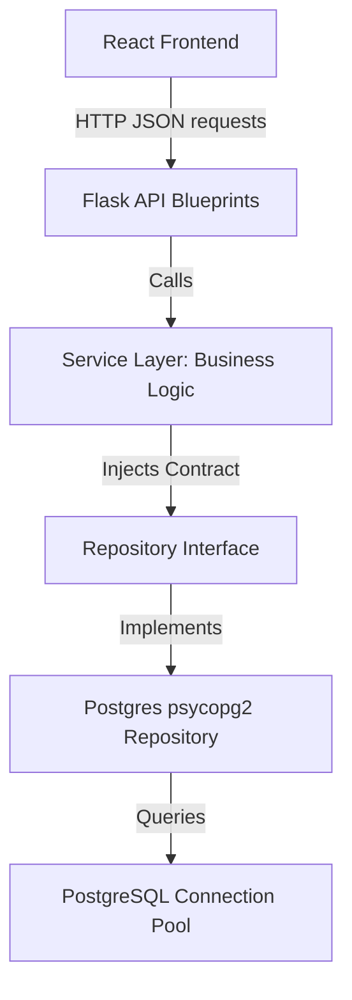

# System Architecture Documentation

This document describes the design principles, architectural patterns, and engineering choices implemented in the Pikud360 Workforce Management System.

---

## Architectural Principles

Our design complies with **Clean Architecture** boundaries and **SOLID** software engineering principles.

### 1. Separation of Concerns (Layered Architecture)
The backend is split into distinct logical boundaries:
* **API Layer (`app/api/v1/`)**: Controllers that extract request parameters, validate client input structures, call underlying services, and format standardized JSON envelopes via `ApiResponse`. They do not query the database directly.
* **Service Layer (`app/services/`)**: The core domain engine where business rules reside. Services depend on *abstractions* (Repository interfaces) rather than concrete database access implementations.
* **Repository Layer (`app/repositories/`)**: Encapsulates persistence details, generating SQL queries and accessing database connections using `psycopg2`.

### 2. Dependency Injection
To keep the layers decoupled and testable, services accept their required repository implementation inside their constructors (`__init__`). This allows mock database layers to be injected during automated unit testing.

### 3. Repository Pattern
Data mutations are decoupled from business logic using `BaseRepository` contracts. Should PostgreSQL be swapped for another datastore later, only the Repository layer requires updating—leaving the Service layer completely untouched.

---

## Database Connection Pooling
To guarantee high performance under enterprise loads:
* We utilize `psycopg2.pool.ThreadedConnectionPool` to handle multi-threaded concurrency.
* Connections are leased from the pool via a context manager (`get_db_connection()`), which automatically releases the connection back to the pool once the transaction ends (even if an error occurs).
* A thread-safe global connection manager performs live health checks (`check_health()`) using `SELECT 1;` pings.

---

## Global Error Filtering
* Errors are caught globally via Flask's `@app.errorhandler` hook in `app/core/errors.py`.
* A domain-specific `AppError` is thrown inside services to signal validation issues, authorization failures, or resource omissions.
* The system intercepts these and replies with standardized JSON envelopes, preventing stack traces or database connection messages from leaking to clients.
