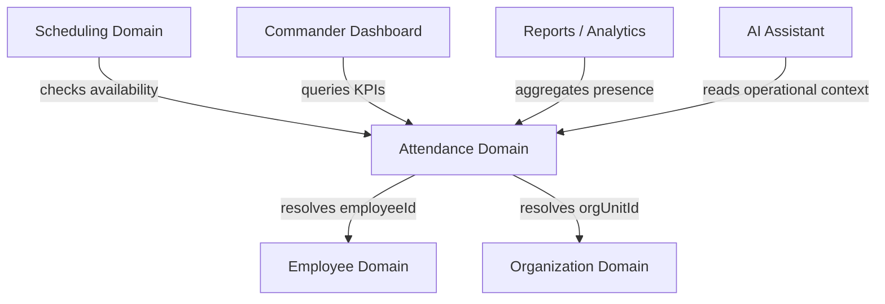
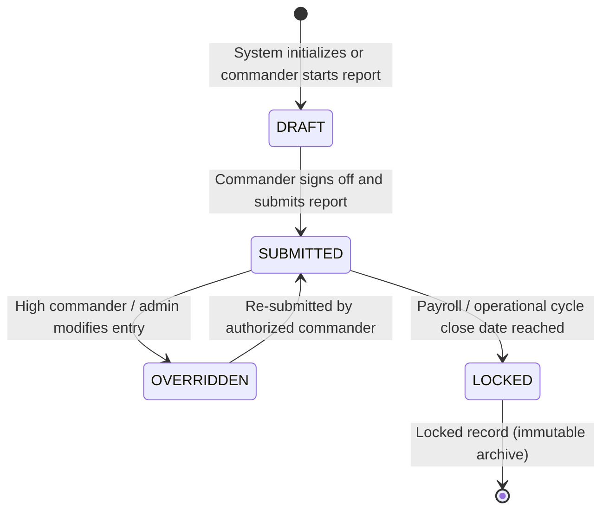

# Attendance Domain Architecture

**Domain:** Attendance (נוכחות)  
**Phase:** 13.1 — Attendance Domain Architecture  
**Status:** Approved Design

---

## 1. Overview

The Attendance domain is the operational engine of Pikud360 that tracks the **daily presence and physical status** of all active personnel. It records *where* an employee is and *what* their operational status is for any given calendar date.

While the Employee domain owns *who* the person is, the Attendance domain owns *where they are stationed* and *their availability to execute tasks* day-by-day.

---

## 2. Domain Responsibilities

The Attendance domain owns all rules, calculations, and data transactions related to daily reporting.

### 2.1 Core Responsibilities

| Responsibility | Description |
|---|---|
| **Daily Status Tracking** | Recording a single status code (e.g. Present, Leave, Sick, Reinforcement, Course) for each employee per calendar date. |
| **Attendance Reporting Cycle** | Managing the workflow of daily submission: from draft reporting to commander sign-off. |
| **Unit Roll Call Verification** | Tracking which sub-units have submitted their attendance reports for the day, and which are overdue. |
| **Operational Gaps Calculation** | Computing the difference between scheduled shift needs and reported available personnel for the day. |
| **Historical Reporting** | Preserving daily presence records for audit, analytics, and compliance. |
| **Retroactive Corrections** | Managing commander updates to historical attendance records under strict audit logs. |

### 2.2 What the Attendance Domain does NOT Own

| Not Owned | Belongs To |
|---|---|
| Shift scheduling planning | `workforce_schedule` (Scheduling) |
| Employee personal files | `workforce` (Employee) |
| Organization unit hierarchy | `organization` (Organization) |
| Notification routing | `notifications` (Notifications) |
| User credentials and login | `security` (Security) |

---

## 3. Domain Boundaries

To maintain high cohesion and low coupling, the boundaries of the Attendance domain are strictly enforced:

```
                  ┌──────────────────────┐
                  │   Employee Domain    │
                  │   (who the person is)│
                  └──────────┬───────────┘
                             │
                             ▼ (references employeeId)
  ┌─────────────────────────────────────────────────────────────┐
  │ Attendance Domain Boundary                                  │
  │                                                             │
  │  Owns:                                                      │
  │  - Daily status records (workforce_schedule.daily_schedules)│
  │  - Status codes configuration (present, absent, sick...)    │
  │  - Submission state (draft, submitted, locked)              │
  │                                                             │
  │  Does NOT Own:                                              │
  │  - Employee Profile fields (DOB, Rank, Position)            │
  │  - Shift templates or calendar structures                   │
  └──────────────────────────┬──────────────────────────────────┘
                             │
                             ▼ (references statusId)
                  ┌──────────┴───────────┐
                  │  Scheduling Domain   │
                  │  (planning & shifts) │
                  └──────────────────────┘
```

- **Separation from Employee**: The Attendance record contains only `employee_id`, `date`, `status_id`, and `notes`. It does not duplicate rank, position, or unit path. If an employee is transferred, their historical attendance records remain under the source unit ID recorded at the time of the attendance entry, preserving historical truth.
- **Separation from Scheduling**: Scheduling is *predictive* (defining future shifts and plans). Attendance is *actual* (recording who showed up today). While both share the status list (e.g. Present, Absent), the Attendance domain owns the submission state of the unit's daily roll call.

---

## 4. Business Ownership Model

```
┌─────────────────────────────────────────────────────────────────┐
│ Attendance Domain Ownership                                     │
│                                                                 │
│ - Primary Database Tables:                                      │
│   - `workforce_schedule.employee_daily_schedules` (raw entries)  │
│   - `workforce_schedule.schedule_statuses` (status definitions)  │
│                                                                 │
│ - Business Rules Enforced by: AttendanceService                  │
│                                                                 │
│ - Write Authority: Unit Commanders (for their unit scope only)  │
│                                                                 │
│ - Read Authority: All modules (via aggregated KPI layers)       │
└─────────────────────────────────────────────────────────────────┘
```

No external module is permitted to insert or update rows in `employee_daily_schedules` directly. All mutations must go through the `AttendanceService` boundary to ensure business rule validation, status transition checks, and audit logging.

---

## 5. Relationships & Dependencies

### Dependency Direction
The Attendance domain depends on the **Employee** and **Organization** domains. Other modules (Dashboard, Reports, AI Assistant) depend on the Attendance domain.



### Module Interfaces

- **Employee Profile → Attendance**:
  - The Employee Profile reads derived attendance summaries (e.g., total sick days this year, total vacation used) via read-only queries against the Attendance repository.
- **Transfers → Attendance**:
  - When an employee is permanently transferred, the Transfers module alerts the Attendance domain. Future daily records are associated with the target unit ID, while historical records remain assigned to the source unit.
- **Dashboard → Attendance**:
  - The Commander Dashboard queries daily attendance statistics (Available %, sick count, absent count) to render the Readiness Gauge and Attendance Summary widgets.

---

## 6. Attendance Entry Lifecycle

Each employee's daily status record passes through a defined lifecycle. The status of the unit's daily report governs the state of the individual entries.

### 6.1 State Machine Diagram



### 6.2 State Descriptions

---

#### 1. DRAFT (טיוטה)

**Description:**
The daily record has been initialized (automatically by the system or manually by an operator) but has not been formally submitted by the commander.

**Business Rules:**
- Entries in DRAFT state can be edited by any operator with `manage` scope on the unit.
- DRAFT entries do not count toward finalized operational statistics on higher-level dashboards.
- Skeletons or warnings are shown on the dashboard if a unit's report remains in DRAFT past the daily submission deadline (typically 09:00 AM).

---

#### 2. SUBMITTED (עודכן / אושר)

**Description:**
The unit commander has reviewed the roll call and signed off on the daily attendance report.

**Business Rules:**
- Commits the daily figures to the dashboard KPIs and parent unit aggregates.
- Changes to SUBMITTED records trigger an `ATTENDANCE_CORRECTED` audit log entry.
- Re-submission updates the submission timestamp and records the operator who performed the update.

---

#### 3. OVERRIDDEN (עודכן על ידי דרג ממונה)

**Description:**
An entry has been altered by an operator with authority over a parent unit (e.g. Battalion commander correcting a Company commander's report).

**Business Rules:**
- Requires an explicit change reason.
- Fires a notification to the original unit commander alerting them of the change.
- Can be returned to SUBMITTED state if the original commander reviews and accepts the change.

---

#### 4. LOCKED (נעול)

**Description:**
The record has been locked because the operational period has closed (e.g. monthly reporting freeze or historical archival threshold reached).

**Business Rules:**
- The record is fully read-only. No updates are permitted by any operator, including admins.
- Ophthalmic visual lock badge is shown in all UI list and profile views.

---

## 7. Core Business Rules

| Rule ID | Rule Statement | Reason |
|---|---|---|
| **BR-A01** | Every active employee must have exactly one daily status entry per calendar date. | Prevents missing data gaps in unit strength accounting. |
| **BR-A02** | The default daily status is initialized to `UNASSIGNED` (לא מדווח) at 00:00 AM daily. | Ensures unsubmitted reports are clearly identified rather than defaulting to "present". |
| **BR-A03** | Daily reports must be submitted by the unit commander before the configured daily deadline (e.g. 09:00 AM). | Ensures the readiness gauge displays fresh, accurate data during morning briefs. |
| **BR-A04** | An employee in `ON_LEAVE` status must have their daily status automatically locked to `VACATION` or `SICK` during their leave dates. | Prevents scheduling errors where a soldier on leave is accidentally reported as present in the unit. |
| **BR-A05** | Retroactive status changes are permitted up to 30 days in the past. Older changes require Admin approval. | Protects historical reporting integrity from retroactive manipulation. |
| **BR-A06** | Every attendance modification must write an audit log entry detailing the previous status, new status, operator, and timestamp. | Maintains compliance and accountability for strength reports. |
| **BR-A07** | A unit report cannot be submitted if any active employee in the unit remains in `UNASSIGNED` state. | Forces commanders to account for every individual before submitting the report. |
