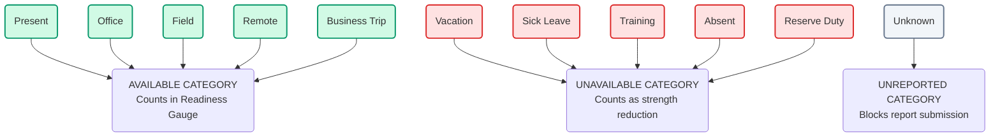

# Attendance Status Model

**Domain:** Attendance  
**Phase:** 13.2 — Attendance Status Model  
**Depends on:** attendance-domain.md

---

## 1. Overview

Pikud360 uses a standardized catalog of **11 attendance statuses** to categorize the operational availability of personnel on any calendar date. 

Each status defines a specific business state, has a designated visual style (color and icon), specifies permitted transitions, and carries operational business rules.

---

## 2. Status Catalog

---

### 2.1 Present (נוכח)

- **Description:** The employee is physically present at their default duty station and fully available for operational tasking.
- **Visual Design Tokens:**
  - **Color:** Emerald Green (CSS: `bg-emerald-50 text-emerald-700 border-emerald-200 dark:bg-emerald-950/30 dark:text-emerald-400 dark:border-emerald-800/50`)
  - **Icon:** `UserCheck` (Lucide React icon name)
- **Allowed Transitions:**
  - Can transition to: `Office`, `Field`, `Remote`, `Vacation`, `Sick Leave`, `Training`, `Business Trip`, `Absent`.
  - Transitions to `Reserve Duty` or `Unknown` are prohibited (unless resetting a daily report).
- **Business Rules:**
  - Counted as "Available Today" in the readiness gauge.
  - Represents the default active presence category.
  - Eligible for all standard scheduling assignments.

---

### 2.2 Office (משרד)

- **Description:** The employee is working on-site at the unit's administrative headquarters or office building.
- **Visual Design Tokens:**
  - **Color:** Blue (CSS: `bg-blue-50 text-blue-700 border-blue-200 dark:bg-blue-950/30 dark:text-blue-400 dark:border-blue-800/50`)
  - **Icon:** `Building2`
- **Allowed Transitions:**
  - Can transition to: `Present`, `Field`, `Remote`, `Vacation`, `Sick Leave`, `Training`, `Business Trip`, `Absent`.
- **Business Rules:**
  - Counted as "Available Today".
  - Assumed to have computer/network access for administrative tasking.
  - Eligible for desk-based or HQ scheduling roles.

---

### 2.3 Field (שטח)

- **Description:** The employee is deployed in the field, at a training range, or at a tactical forward station.
- **Visual Design Tokens:**
  - **Color:** Amber / Brown (CSS: `bg-amber-50 text-amber-700 border-amber-200 dark:bg-amber-950/30 dark:text-amber-400 dark:border-amber-800/50`)
  - **Icon:** `Tent`
- **Allowed Transitions:**
  - Can transition to: `Present`, `Office`, `Vacation`, `Sick Leave`, `Training`, `Business Trip`, `Absent`.
  - Transition directly to `Remote` is blocked (requires returning to Base/HQ first).
- **Business Rules:**
  - Counted as "Available Today".
  - Assumed to have restricted or radio-only communications.
  - Eligible for field operations and physical safety roles.

---

### 2.4 Remote (עבודה מרחוק)

- **Description:** The employee is working from home or an external secure location off-site.
- **Visual Design Tokens:**
  - **Color:** Cyan (CSS: `bg-cyan-50 text-cyan-700 border-cyan-200 dark:bg-cyan-950/30 dark:text-cyan-400 dark:border-cyan-800/50`)
  - **Icon:** `Home`
- **Allowed Transitions:**
  - Can transition to: `Present`, `Office`, `Vacation`, `Sick Leave`, `Training`, `Business Trip`.
  - Transition directly to `Field` or `Absent` is blocked.
- **Business Rules:**
  - Counted as "Available Today".
  - Requires explicit authorization parameters in the notes field (e.g. "Work From Home Agreement").
  - Ineligible for physical guard duties or on-site hardware maintenance shifts.

---

### 2.5 Vacation (חופשה)

- **Description:** The employee is on approved annual leave, personal leave, or holiday.
- **Visual Design Tokens:**
  - **Color:** Sky Blue (CSS: `bg-sky-50 text-sky-700 border-sky-200 dark:bg-sky-950/30 dark:text-sky-400 dark:border-sky-800/50`)
  - **Icon:** `Palmtree`
- **Allowed Transitions:**
  - Can transition to: `Present`, `Office`, `Sick Leave` (if leave is canceled due to illness).
  - Transitions directly to `Field`, `Remote`, or `Training` are blocked unless the leave record is revoked.
- **Business Rules:**
  - Counted as "Unavailable Today" (Absent count in basic dashboard, but explicitly categorized as "On Vacation").
  - Deducts from the employee's `leaveBalance` upon submission.
  - The scheduling module blocks any shift assignment on vacation dates.

---

### 2.6 Sick Leave (מחלה)

- **Description:** The employee is absent due to illness, medical treatment, or recuperation (e.g., "ימי גימלים").
- **Visual Design Tokens:**
  - **Color:** Rose Red (CSS: `bg-rose-50 text-rose-700 border-rose-200 dark:bg-rose-950/30 dark:text-rose-400 dark:border-rose-800/50`)
  - **Icon:** `Stethoscope`
- **Allowed Transitions:**
  - Can transition to: `Present`, `Office`, `Vacation` (convalescence transitions).
  - Transitions to `Field`, `Remote`, or `Training` are blocked until cleared by medical override.
- **Business Rules:**
  - Counted as "Unavailable Today" (Sick count in basic dashboard).
  - Exceeding the unit's sick threshold (e.g., 5% of unit strength) triggers a critical alert on the dashboard.
  - Scheduling engine blocks all shift assignments.

---

### 2.7 Reserve Duty (שירות מילואים)

- **Description:** Applicable to reserve personnel called up for active operational service. For permanent staff, it signifies they are serving as liaison/support for reserve units.
- **Visual Design Tokens:**
  - **Color:** Olive Green (CSS: `bg-olive-50 text-olive-700 border-olive-200 dark:bg-olive-950/30 dark:text-olive-400 dark:border-olive-800/50` — custom class mapped in tailwind.config)
  - **Icon:** `Milestone`
- **Allowed Transitions:**
  - Can transition to: `Present`, `Office`, `Field`, `Sick Leave`.
- **Business Rules:**
  - Counted as "Available Today" or "Unavailable Today" depending on the scheduling mode (Reserve context counts as active operational strength if deployed within the unit).
  - Integrates with the `ReserveDutyPeriod` dates defined on the employee profile.

---

### 2.8 Training (אימון / קורס)

- **Description:** The employee is attending a formal training course, professional certification seminar, or military exercise.
- **Visual Design Tokens:**
  - **Color:** Violet (CSS: `bg-violet-50 text-violet-700 border-violet-200 dark:bg-violet-950/30 dark:text-violet-400 dark:border-violet-800/50`)
  - **Icon:** `GraduationCap`
- **Allowed Transitions:**
  - Can transition to: `Present`, `Office`, `Field`, `Vacation`, `Sick Leave`, `Business Trip`.
- **Business Rules:**
  - Counted as "Unavailable Today" for routine unit operations (categorized under "Training").
  - The notes field must record the course/seminar name.
  - Excluded from routine unit shift rotations, but eligible for training-specific assessments.

---

### 2.9 Business Trip (נסיעת עבודה)

- **Description:** The employee is traveling on official business, attending external coordination meetings, or stationed temporarily at another unit's command post.
- **Visual Design Tokens:**
  - **Color:** Indigo (CSS: `bg-indigo-50 text-indigo-700 border-indigo-200 dark:bg-indigo-950/30 dark:text-indigo-400 dark:border-indigo-800/50`)
  - **Icon:** `Plane`
- **Allowed Transitions:**
  - Can transition to: `Present`, `Office`, `Field`, `Vacation`, `Sick Leave`.
- **Business Rules:**
  - Counted as "Available Today" (but flagged as traveling/external).
  - Assumed reachable via phone/email.
  - Eligible only for remote/on-call scheduling roles during travel dates.

---

### 2.10 Absent (נפקד / נעדר)

- **Description:** The employee failed to report for duty with no approved justification (unauthorized absence / AWOL).
- **Visual Design Tokens:**
  - **Color:** Red (CSS: `bg-red-50 text-red-700 border-red-200 dark:bg-red-950/30 dark:text-red-400 dark:border-red-800/50`)
  - **Icon:** `UserX`
- **Allowed Transitions:**
  - Can transition to: `Present`, `Office`, `Sick Leave` (if medical excuse is later verified).
  - Transition directly to `Vacation` or `Remote` is blocked (unauthorized absence cannot be retroactively converted to vacation without commander override + audit reason).
- **Business Rules:**
  - Counted as "Unavailable Today" (Absent count).
  - Triggers an immediate critical notification to the direct commander.
  - Excluded from all scheduling pools.
  - Status persists daily until the employee is located or formally transitioned to `SUSPENDED` lifecycle state.

---

### 2.11 Unknown (לא ידוע)

- **Description:** Default state when daily roll call has not yet been reported for this employee.
- **Visual Design Tokens:**
  - **Color:** Slate / Gray (CSS: `bg-slate-50 text-slate-700 border-slate-200 dark:bg-slate-950/30 dark:text-slate-400 dark:border-slate-800/50`)
  - **Icon:** `HelpCircle`
- **Allowed Transitions:**
  - Can transition to: Any active status.
- **Business Rules:**
  - Renders as `UNASSIGNED` in raw API payloads.
  - Excluded from availability calculations (shows as "Unreported" in dashboards).
  - The presence of any `Unknown` records blocks the commander from submitting the unit's final daily report (BR-A07).

---

## 3. Transition Matrix

The table below lists whether a transition from the **Row Status** to the **Column Status** is permitted by default.

| From \ To | Present | Office | Field | Remote | Vacation | Sick | Reserve | Training | Trip | Absent | Unknown |
|---|---|---|---|---|---|---|---|---|---|---|---|
| **Present** | — | ✅ | ✅ | ✅ | ✅ | ✅ | ❌ | ✅ | ✅ | ✅ | ❌ |
| **Office** | ✅ | — | ✅ | ✅ | ✅ | ✅ | ❌ | ✅ | ✅ | ✅ | ❌ |
| **Field** | ✅ | ✅ | — | ❌ | ✅ | ✅ | ❌ | ✅ | ✅ | ✅ | ❌ |
| **Remote** | ✅ | ✅ | ❌ | — | ✅ | ✅ | ❌ | ✅ | ✅ | ❌ | ❌ |
| **Vacation**| ✅ | ✅ | ❌ | ❌ | — | ✅ | ❌ | ❌ | ❌ | ❌ | ❌ |
| **Sick** | ✅ | ✅ | ❌ | ❌ | ✅ | — | ❌ | ❌ | ❌ | ❌ | ❌ |
| **Reserve** | ✅ | ✅ | ✅ | ❌ | ❌ | ✅ | — | ❌ | ❌ | ❌ | ❌ |
| **Training**| ✅ | ✅ | ✅ | ❌ | ✅ | ✅ | ❌ | — | ✅ | ❌ | ❌ |
| **Trip** | ✅ | ✅ | ✅ | ❌ | ✅ | ✅ | ❌ | ❌ | — | ❌ | ❌ |
| **Absent** | ✅ | ✅ | ❌ | ❌ | ❌ | ✅ | ❌ | ❌ | ❌ | — | ❌ |
| **Unknown** | ✅ | ✅ | ✅ | ✅ | ✅ | ✅ | ✅ | ✅ | ✅ | ✅ | — |

---

## 4. Status Category Classifications

Every status maps to one of three **Availability Categories** used to calculate summary indices and compile reporting widgets:

- **AVAILABLE (זמינים)**: Present, Office, Field, Remote, Business Trip.
- **UNAVAILABLE (לא זמינים)**: Vacation, Sick Leave, Reserve Duty, Training, Absent.
- **UNREPORTED (לא מדווח)**: Unknown.
