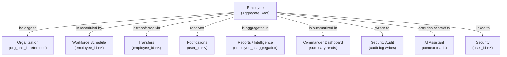

# Employee Domain Architecture

**Domain:** Employee
**Phase:** 12.1 — Employee Domain Architecture
**Status:** Approved Design

---

## 1. Overview

The Employee domain is the **central business entity** of Pikud360. Every module in the system either reads from, writes to, or reacts to changes in the Employee aggregate.

An Employee represents a real person serving in the organization — a soldier, officer, or civilian staff member. The Employee domain owns all persistent facts about that person that exist independently of any module.

Every other domain must treat the Employee as an **external dependency**, not as a data structure it owns.

---

## 2. Domain Principles

| Principle | Application |
|---|---|
| **Single Source of Truth** | One Employee record per person. No module stores a copy of employee identity or employment data. |
| **High Cohesion** | The Employee domain owns only what is intrinsic to the person — not what they did or where they were scheduled. |
| **Low Coupling** | Other domains reference employees by `employee_id` (UUID). They do not import Employee models. |
| **Domain-Driven Design** | Employee is the Aggregate Root. Its boundaries are enforced at the service layer. |
| **Separation of Concerns** | Identity ≠ Attendance ≠ Scheduling ≠ Notifications. Each domain owns its own slice. |
| **Future Scalability** | The Employee aggregate is designed to accept new attributes (certifications, skills, availability profiles) without breaking existing consumers. |
| **Backward Compatibility** | New fields are additive only. Existing consumers are not broken by new attributes. |

---

## 3. Domain Responsibilities

### 3.1 What the Employee Domain Owns

| Responsibility | Description |
|---|---|
| **Identity** | First name, last name, employee number, date of birth |
| **Rank** | Current military or civilian rank |
| **Position** | Role / role title within the unit |
| **Service Type** | Mandatory service, career service, reserve, civilian |
| **Organizational Assignment** | Which `org_unit_id` this employee belongs to |
| **Direct Commander Reference** | `commander_id` — the employee ID of their direct superior |
| **Contact Information** | Phone (encrypted), personal email (encrypted) |
| **Employment Status** | The current lifecycle state (ACTIVE, INACTIVE, ON_LEAVE, etc.) |
| **System User Link** | Optional `user_id` linking to the security user account |
| **Change History** | Immutable record of every change to the employee record (via `EmployeeHistory`) |
| **Audit Trail** | Every read/write event written to the security audit log |

### 3.2 Future Responsibilities (Planned Extensions)

| Responsibility | Description |
|---|---|
| **Skills** | Professional skills associated with the employee role |
| **Certifications** | Training certifications with expiry dates (Medic, Driver, etc.) |
| **Availability Profile** | Standard availability schedule preferences per employee |
| **Profile Picture** | Avatar / photo linked to employee identity |
| **Emergency Contact** | Next-of-kin contact for emergency situations |
| **Preferred Language** | UI localization preference |

### 3.3 What the Employee Domain Does NOT Own

| Not Owned | Belongs To |
|---|---|
| Daily attendance records | `workforce_schedule` module |
| Shift assignments | `workforce_schedule` module |
| Transfer workflow state | `transfers` module |
| Notifications sent to the employee | `notifications` module |
| Report aggregations | `reports` / `intelligence` module |
| Alert thresholds and triggers | `intelligence.alerts` module |
| Authentication credentials | `security` module |
| Permission roles | `security` / `admin` module |
| Organization hierarchy structure | `organization` module |

---

## 4. Aggregate Root

The `Employee` is the **Aggregate Root** of this domain.

All mutations to employee data must go through the `WorkforceService`, which enforces:

- Access scope validation before every operation
- Immutable history recording after every mutation
- Audit log writing for every read and write event

No external module may write to the `workforce.employees` table directly. All writes must go through the service boundary.

### Current Aggregate Fields

```
Employee
├── id                  UUID — Primary key
├── tenant_id           UUID — Multi-tenancy isolation key
├── org_unit_id         UUID — FK to core.organization_units
├── employee_number     String — Unique within tenant
├── first_name          String — Encrypted at rest
├── last_name           String — Encrypted at rest
├── birthdate           String — Encrypted at rest (YYYY-MM-DD)
├── rank                String
├── position            String
├── service_type        String — Enum: MANDATORY, CAREER, RESERVE, CIVILIAN
├── status              String — Lifecycle state
├── user_id             UUID (optional) — FK to security.users
├── commander_id        UUID (optional) — FK to workforce.employees (self-referential)
├── phone               String (optional) — Encrypted at rest
├── personal_email      String (optional) — Encrypted at rest
├── phone_blind_index   String — Allows phone search without decryption
├── email_blind_index   String — Allows email search without decryption
├── created_at          Timestamp
├── updated_at          Timestamp
├── deleted_at          Timestamp (soft delete)
├── created_by          UUID — Operator user ID
└── updated_by          UUID — Operator user ID
```

### Change History Aggregate

```
EmployeeHistory
├── id                  UUID — Primary key
├── employee_id         UUID — FK to workforce.employees
├── change_type         String — EMPLOYEE_CREATED | EMPLOYEE_UPDATED | EMPLOYEE_TRANSFERRED | EMPLOYEE_DELETED
├── snapshot_json       JSON — { before: {...}, after: {...} }
├── org_unit_id         UUID — Unit at time of change
├── commander_id        UUID — Commander at time of change
├── rank                String — Rank at time of change
├── position            String — Position at time of change
├── service_type        String — Service type at time of change
├── status              String — Status at time of change
├── effective_from      Timestamp
├── effective_to        Timestamp
├── change_reason       String (optional)
├── recorded_by         UUID — Operator who performed the change
└── created_at          Timestamp
```

---

## 5. Business Rules

| Rule ID | Rule |
|---|---|
| BR-E01 | An employee must belong to exactly one organization unit at all times. |
| BR-E02 | An employee's `employee_number` must be unique within its tenant. |
| BR-E03 | Only a user with `manage` scope over the employee's unit may create, update, or delete that employee. |
| BR-E04 | Any operator may view their own employee profile, regardless of unit scope. |
| BR-E05 | A soft-deleted employee (`deleted_at IS NOT NULL`) is excluded from all active queries. |
| BR-E06 | Every write operation must create an immutable `EmployeeHistory` record before returning. |
| BR-E07 | Every read and write operation must produce an audit log entry. |
| BR-E08 | Transferring an employee to a new unit requires `manage` scope on both the source and the target unit. |
| BR-E09 | The `commander_id` field must reference an existing, active employee within the same tenant. |
| BR-E10 | Encrypted fields (phone, email, birthdate) must never be logged in plaintext in audit or history records. |
| BR-E11 | An employee in `INACTIVE` or soft-deleted state must not be assigned to schedules or transfers. |
| BR-E12 | The `service_type` field determines eligibility rules in scheduling (future: mandatory service employees have different scheduling constraints). |

---

## 6. Ownership Model

```
┌─────────────────────────────────────────────────┐
│                Employee Domain                   │
│                                                  │
│  Owner: workforce module (backend)               │
│  Table: workforce.employees                      │
│  History: workforce.employee_history             │
│  Service: WorkforceService                       │
│  Repository: EmployeeRepository                  │
│                                                  │
│  Write Access: WorkforceService only             │
│  Read Access: All modules via employee_id FK     │
│                                                  │
│  Cross-boundary reads: by employee_id reference  │
│  Cross-boundary writes: prohibited               │
└─────────────────────────────────────────────────┘
```

No external module should JOIN directly to `workforce.employees` for business logic. They should pass `employee_id` references and call the Employee API when they need profile data.

---

## 7. Relationships with Other Modules



Dependency direction: **all arrows point away from Employee**. The Employee domain does not depend on any other domain.

---

## 8. Domain Events

The following business events should be raised by the Employee domain when key lifecycle transitions occur. These are currently recorded via `EmployeeHistory` and the audit log. A future event bus integration would publish these as structured messages.

| Event | Trigger |
|---|---|
| `EmployeeCreated` | A new employee record is persisted |
| `EmployeeUpdated` | Any profile field changes on an existing employee |
| `EmployeeTransferred` | `org_unit_id` changes — employee moves to a new unit |
| `EmployeeStatusChanged` | `status` field transitions to a new lifecycle state |
| `EmployeeActivated` | Status transitions to `ACTIVE` from any non-active state |
| `EmployeeDeactivated` | Status transitions to `INACTIVE` |
| `EmployeeOnLeaveStarted` | Status transitions to `ON_LEAVE` |
| `EmployeeOnLeaveEnded` | Status transitions from `ON_LEAVE` back to `ACTIVE` |
| `EmployeeArchived` | Soft delete applied (`deleted_at` is set) |
| `EmployeeRestored` | Soft delete reversed (`deleted_at` cleared) |
| `EmployeeCommanderChanged` | `commander_id` field changes |
| `EmployeeCertificationAdded` | A new certification is attached *(future)* |
| `EmployeeCertificationExpired` | A certification passes its expiry date *(future)* |
| `EmployeeSkillAdded` | A skill is added to the employee profile *(future)* |
| `EmployeeProfileViewed` | An operator views an employee record (audit-only event) |

---

## 9. Security and Privacy

| Concern | Implementation |
|---|---|
| **Encryption at rest** | `birthdate`, `phone`, `personal_email` are encrypted using AES-256 before database write |
| **Blind indexes** | `phone_blind_index`, `email_blind_index` allow searchability without decryption |
| **Scope enforcement** | Every service method validates operator scope before executing |
| **Audit completeness** | Every read and write produces an audit log entry via `AuditLogRepository` |
| **Soft delete only** | Employee records are never hard-deleted; `deleted_at` is set |
| **Tenant isolation** | Every query filters by `tenant_id` — cross-tenant reads are structurally impossible |

---

## 10. Future Extensibility

| Extension | Approach |
|---|---|
| **Certifications** | Add `workforce.employee_certifications` table; FK to `employee_id`. Add `EmployeeCertificationExpired` event. |
| **Skills** | Add `workforce.employee_skills` and `workforce.skill_catalog` tables; FK to `employee_id`. |
| **Availability Profile** | Add `workforce.employee_availability` table; FK to `employee_id`. Used by scheduling for future auto-assignment. |
| **Profile Picture** | Add `profile_picture_url` field referencing object storage. No encryption required. |
| **Event Bus** | When messaging infrastructure is introduced, `EmployeeHistory` entries map 1:1 to publishable domain events. |
| **Multi-rank Tracking** | `EmployeeHistory` already captures rank per change. A rank promotion history view can be derived without schema changes. |
| **External System Sync** | `employee_number` is the canonical external key for integration with HR or military personnel systems. |
