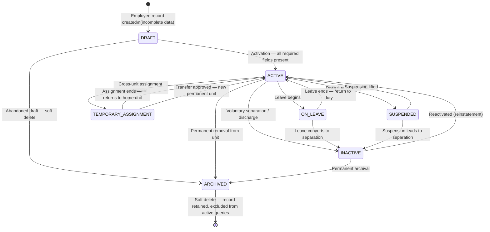

# Employee Lifecycle

**Domain:** Employee
**Phase:** 12.1 — Employee Domain Architecture

---

## 1. Overview

The Employee lifecycle defines all possible states an employee can occupy during their service in the organization, and the rules governing how they transition between states.

Every state has a clear business meaning, entry and exit conditions, and a defined set of permitted transitions. No state transition may occur outside of the rules defined here.

---

## 2. Lifecycle State Diagram

---

## 3. State Definitions

---

### 3.1 DRAFT

**Description:**
An employee record has been started but is not yet complete enough to be operationally active. The record exists in the database but is hidden from all active queries and module integrations.

**Business context:**
Used when a commander or admin is in the middle of creating a new employee profile. Enables save-and-continue workflows without polluting active workforce data.

**Entry Conditions:**
- An operator with `manage` scope creates a new employee record with `status = DRAFT`.
- A future import pipeline creates an incomplete record pending review.

**Exit Conditions:**
- All required fields are validated and present.
- The operator explicitly activates the record.

**Allowed Transitions:**

| To State | Trigger | Actor |
|---|---|---|
| `ACTIVE` | All required fields complete; operator activates | Commander / Admin |
| `ARCHIVED` | Draft abandoned; operator deletes | Commander / Admin |

**Included in active workforce queries:** No
**Included in scheduling:** No
**Included in dashboard KPIs:** No

**Related Business Rules:**
- BR-E11: A DRAFT employee must not be assigned to schedules or transfers.
- A DRAFT employee does not count toward unit headcount.

---

### 3.2 ACTIVE

**Description:**
The employee is currently serving in their assigned organizational unit. This is the normal operational state for all personnel.

**Business context:**
ACTIVE employees are the primary subject of all dashboard KPIs, attendance tracking, scheduling, and reporting. The majority of the workforce should always be in this state.

**Entry Conditions:**
- Transition from `DRAFT`: all required fields present and operator activates.
- Transition from `ON_LEAVE`: leave period ends and employee returns to duty.
- Transition from `SUSPENDED`: suspension is formally lifted.
- Transition from `INACTIVE`: employee is reinstated (e.g., reserve soldier recalled).
- Transition from `TEMPORARY_ASSIGNMENT`: temporary assignment ends and employee returns to home unit, or a transfer is approved making the new unit permanent.

**Exit Conditions:**
- Leave is formally approved → `ON_LEAVE`.
- A temporary assignment is initiated → `TEMPORARY_ASSIGNMENT`.
- Disciplinary action is issued → `SUSPENDED`.
- Employee exits the organization → `INACTIVE`.
- Permanent organizational removal → `ARCHIVED`.

**Allowed Transitions:**

| To State | Trigger | Actor |
|---|---|---|
| `ON_LEAVE` | Leave request approved | Commander |
| `TEMPORARY_ASSIGNMENT` | Cross-unit assignment initiated | Commander / Admin |
| `SUSPENDED` | Disciplinary action recorded | Admin |
| `INACTIVE` | Separation from service | Admin |
| `ARCHIVED` | Permanent removal | Admin |

**Included in active workforce queries:** Yes
**Included in scheduling:** Yes
**Included in dashboard KPIs:** Yes (counts toward present/absent/sick breakdowns)

**Related Business Rules:**
- BR-E01: ACTIVE employee belongs to exactly one unit.
- BR-E03: Only authorized scope managers may change this state.

---

### 3.3 ON_LEAVE

**Description:**
The employee is temporarily absent from duty due to an approved leave (vacation, medical, personal, or administrative leave). They retain their organizational assignment and will return to ACTIVE status.

**Business context:**
ON_LEAVE employees are tracked separately in attendance reports. They count toward the unit headcount but not toward the available operational force. Dashboard KPIs reflect leave counts separately from absenteeism.

**Entry Conditions:**
- Transition from `ACTIVE`: an approved leave request is recorded.
- Leave start date is reached.

**Exit Conditions:**
- Leave end date is reached or the employee returns early.
- Leave is extended and converts to a formal separation.

**Allowed Transitions:**

| To State | Trigger | Actor |
|---|---|---|
| `ACTIVE` | Leave period ends; employee returns to duty | Commander / System |
| `INACTIVE` | Leave converts to formal separation | Admin |

**Included in active workforce queries:** Yes (as separate leave category)
**Included in scheduling:** No (excluded from shift assignment during leave)
**Included in dashboard KPIs:** Yes (counted under `vacationCount` in workforce summary)

**Duration:**
Leave has a defined start and end date. Tracking via the `workforce_schedule` module using the VACATION/SICK status codes.

**Related Business Rules:**
- An employee on leave cannot be assigned to shifts.
- Leave periods are not gaps in employment history — continuity is preserved.

---

### 3.4 TEMPORARY_ASSIGNMENT

**Description:**
The employee has been temporarily assigned to a different organizational unit while retaining their home unit affiliation. This is distinct from a permanent transfer.

**Business context:**
Military operational context frequently requires temporary cross-unit assignments (reinforcements, specialized task forces, temporary command). The employee's permanent `org_unit_id` does not change during a temporary assignment.

**Entry Conditions:**
- Transition from `ACTIVE`: commander initiates a temporary assignment with a defined duration.
- A `TEMPORARY_ASSIGNMENT` record is created (future: `workforce.employee_assignments` table).

**Exit Conditions:**
- The assignment duration ends.
- The assignment is terminated early.
- A permanent transfer is approved, converting the temporary assignment into a permanent change.

**Allowed Transitions:**

| To State | Trigger | Actor |
|---|---|---|
| `ACTIVE` | Assignment ends; employee returns to home unit | System / Commander |
| `ACTIVE` | Transfer approved; new unit becomes permanent | Admin / Commander |

**Included in active workforce queries:** Yes (attributed to home unit by default; optionally to assignment unit)
**Included in scheduling:** Yes (scheduling follows the assignment unit during the assignment period)
**Included in dashboard KPIs:** Configurable — may appear in both source and target unit counts

**Related Business Rules:**
- A TEMPORARY_ASSIGNMENT does not change `org_unit_id` in the Employee aggregate.
- The assignment unit is tracked in a separate record (future extension).

---

### 3.5 SUSPENDED

**Description:**
The employee is subject to a formal disciplinary or administrative suspension. They remain in the system but are excluded from active scheduling and operational assignments.

**Business context:**
Reserved for disciplinary proceedings, security investigations, or administrative holds. The employee record is retained in full. The status is visible to authorized commanders.

**Entry Conditions:**
- Transition from `ACTIVE`: an authorized admin records a formal suspension with a reason.
- A suspension start date is set.

**Exit Conditions:**
- The suspension is formally lifted by an authorized admin.
- The suspension leads to formal separation from service.

**Allowed Transitions:**

| To State | Trigger | Actor |
|---|---|---|
| `ACTIVE` | Suspension lifted | Admin |
| `INACTIVE` | Suspension leads to discharge/separation | Admin |

**Included in active workforce queries:** Yes (as a separate status category)
**Included in scheduling:** No
**Included in dashboard KPIs:** Counted but flagged separately

**Related Business Rules:**
- Only Admin-level operators may initiate or lift a suspension.
- A suspension reason is required and recorded in `EmployeeHistory`.

---

### 3.6 INACTIVE

**Description:**
The employee has exited the organization. Their record is retained for historical reporting, audit trails, and compliance purposes, but they no longer appear in active workforce queries.

**Business context:**
An employee becomes INACTIVE upon: end of mandatory service, voluntary resignation, medical discharge, disciplinary discharge, or completion of reserve duty term. The record is not deleted.

**Entry Conditions:**
- Transition from `ACTIVE`: formal separation is recorded.
- Transition from `ON_LEAVE`: leave converts to separation.
- Transition from `SUSPENDED`: suspension leads to discharge.

**Exit Conditions:**
- Employee is formally reinstated (reserve recall, re-enlistment).
- A decision is made to permanently archive the record.

**Allowed Transitions:**

| To State | Trigger | Actor |
|---|---|---|
| `ACTIVE` | Reactivation / reinstatement | Admin |
| `ARCHIVED` | Decision to permanently archive | Admin |

**Included in active workforce queries:** No
**Included in scheduling:** No
**Included in dashboard KPIs:** No
**Included in history/reports:** Yes

**Related Business Rules:**
- BR-E11: INACTIVE employees cannot be assigned to schedules or transfers.
- Historical scheduling records remain intact and queryable after deactivation.

---

### 3.7 ARCHIVED

**Description:**
The employee record is permanently retired. It is preserved for legal, compliance, and audit purposes but is completely excluded from all operational views.

**Business context:**
Archival is a terminal state for records that are no longer operationally relevant and are unlikely to be reinstated. It is distinct from soft deletion in intent: archival is deliberate; soft deletion is the mechanism.

**Entry Conditions:**
- Transition from `DRAFT`: abandoned draft with no operational history.
- Transition from `INACTIVE`: deliberate administrative archival decision.
- Transition from `ACTIVE`: immediate permanent removal (exceptional cases only).

**Exit Conditions:**
- None. ARCHIVED is a terminal state.
- Restoration is only permitted via an explicit admin action under exceptional circumstances.

**Allowed Transitions:**

| To State | Trigger | Actor |
|---|---|---|
| None | — | — |

**Included in active workforce queries:** No
**Included in scheduling:** No
**Included in dashboard KPIs:** No
**Included in history/reports:** Yes (with archived flag)

**Implementation:** `deleted_at IS NOT NULL` in the database. All standard queries filter `WHERE deleted_at IS NULL`.

**Related Business Rules:**
- Only Admin-level operators may archive an employee.
- Archive reason must be recorded in `EmployeeHistory`.
- Archived records are never hard-deleted from the database.

---

## 4. State Summary Table

| State | Appears in Active Queries | Schedulable | Counts in KPIs | Terminal |
|---|---|---|---|---|
| DRAFT | No | No | No | No |
| ACTIVE | Yes | Yes | Yes | No |
| ON_LEAVE | Yes (separate) | No | Yes | No |
| TEMPORARY_ASSIGNMENT | Yes | Yes | Yes | No |
| SUSPENDED | Yes (separate) | No | Yes | No |
| INACTIVE | No | No | No | No |
| ARCHIVED | No | No | No | Yes |

---

## 5. Transition Authority Matrix

| Transition | Commander | Admin | System |
|---|---|---|---|
| DRAFT → ACTIVE | ✅ | ✅ | — |
| DRAFT → ARCHIVED | — | ✅ | — |
| ACTIVE → ON_LEAVE | ✅ | ✅ | — |
| ACTIVE → TEMPORARY_ASSIGNMENT | ✅ | ✅ | — |
| ACTIVE → SUSPENDED | — | ✅ | — |
| ACTIVE → INACTIVE | — | ✅ | — |
| ACTIVE → ARCHIVED | — | ✅ | — |
| ON_LEAVE → ACTIVE | ✅ | ✅ | ✅ (date-based) |
| ON_LEAVE → INACTIVE | — | ✅ | — |
| TEMPORARY_ASSIGNMENT → ACTIVE | ✅ | ✅ | ✅ (date-based) |
| SUSPENDED → ACTIVE | — | ✅ | — |
| SUSPENDED → INACTIVE | — | ✅ | — |
| INACTIVE → ACTIVE | — | ✅ | — |
| INACTIVE → ARCHIVED | — | ✅ | — |

---

## 6. Lifecycle Events

Each state transition raises a corresponding domain event and creates an immutable `EmployeeHistory` record.

| Transition | Domain Event |
|---|---|
| Any → ACTIVE | `EmployeeActivated` |
| ACTIVE → ON_LEAVE | `EmployeeOnLeaveStarted` |
| ON_LEAVE → ACTIVE | `EmployeeOnLeaveEnded` |
| ACTIVE → SUSPENDED | `EmployeeSuspended` |
| SUSPENDED → ACTIVE | `EmployeeSuspensionLifted` |
| Any → INACTIVE | `EmployeeDeactivated` |
| Any → ARCHIVED | `EmployeeArchived` |
| Any → TEMPORARY_ASSIGNMENT | `EmployeeTemporaryAssignmentStarted` |
| TEMPORARY_ASSIGNMENT → ACTIVE | `EmployeeTemporaryAssignmentEnded` |
