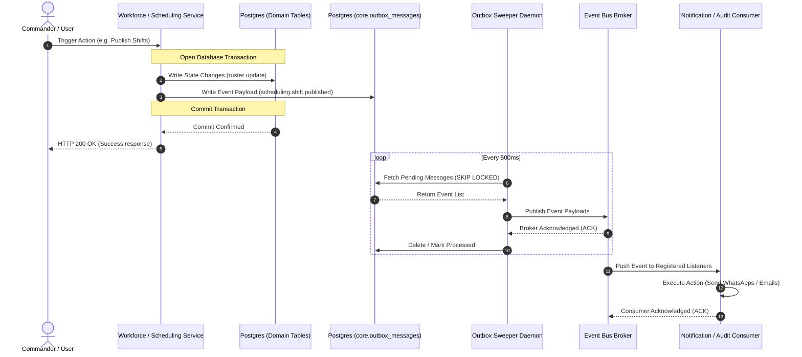

# Internal Event Bus Architecture

**Domain:** Cross-Domain Events / Integration  
**Phase:** 16.5 — Event Bus Architecture  
**Depends on:** event-catalog.md

---

## 1. Overview

This document specifies the internal Event Bus architecture for Pikud360. 

To ensure high reliability, transaction consistency, and loose coupling between domains (Workforce, Scheduling, Attendance, Notifications), the system uses an asynchronous event-driven model based on the **Transactional Outbox Pattern**.

---

## 2. Architectural Components

---

### 2.1 Event Publisher & Transactional Outbox Pattern

To prevent data inconsistencies (e.g., a database transaction commits, but the event broker publication fails), domains do **not** write to the Event Bus directly during operational requests. Instead, they implement the **Transactional Outbox Pattern**:

1. **Atomic Write:** The domain service modifies its tables (e.g. updating an employee status) and writes the corresponding business event payload to a `core.outbox_messages` table within the **same database transaction**.
2. **Outbox Sweeper:** A background worker polls the `core.outbox_messages` table (using `SELECT FOR UPDATE SKIP LOCKED` to support multi-instance environments).
3. **Dispatch:** The sweeper publishes the message payload to the active message broker exchange (e.g. RabbitMQ, Redis Streams, or an internal memory channel).
4. **Pruning:** Upon successful broker acknowledgement, the sweeper marks the outbox row as `PROCESSED` or deletes it.

---

### 2.2 Event Consumer & Subscription Registry

- **Registry:** The Event Bus maintains a registry of subscribed consumers. Modules register dynamic listener handlers mapping to specific event naming patterns (e.g. `scheduling.*`).
- **Worker Pools:** Consumers operate asynchronously inside dedicated thread/worker pools to prevent heavy tasks (like compiling weekly PDF schedules) from blocking HTTP response loops.
- **Delivery Guarantee:** The bus enforces **At-Least-Once Delivery**. Consumers must be prepared to handle duplicate events (see Section 5).

---

## 3. Event Flow Diagram



---

## 4. Resilience: Retry & Dead Letter Handling

---

### 4.1 Consumer Retry Strategy
When a consumer fails to process an event due to transient errors (e.g. SMS provider gateway timeout), it rejects the event and triggers retry schedules:

- **Exponential Backoff with Jitter:** Retries avoid hitting downstream APIs simultaneously.
  - **Schedule:** $Interval = Base \times 2^{attempt} \pm Jitter$ (e.g. 5s, 15s, 45s).
  - **Max Retries:** 3 attempts.

---

### 4.2 Dead Letter Queue (DLQ) Routing
If processing fails after the maximum retry threshold, the consumer acknowledges the broker to remove the message from the main queue and routes it to the Dead Letter Queue:

- **DLQ Payload Wrapping:**
  ```json
  {
    "originalEventId": "evt_998877",
    "eventName": "scheduling.shift.published",
    "lastAttemptAt": "2026-07-19T15:13:00Z",
    "failureReason": "HTTP 502 Bad Gateway from Meta API",
    "retryCount": 3,
    "payload": { ... }
  }
  ```
- **Reprocessing:** The admin console exposes a manual **Replay Tool** to resubmit messages from the DLQ once dependencies are restored.

---

## 5. Idempotency Rules

Since delivery is *at-least-once*, network hiccups can trigger duplicate event consumption. Consumers must enforce idempotency rules:

1. **Unique Event Identifier:** Every event carries a mandatory metadata UUID `eventId`.
2. **Idempotency Key Verification:** Consumers check an `idempotent_consumers` table in their local database schema before executing operations:
   ```sql
   INSERT INTO core.processed_events (event_id, consumer_name, processed_at)
   VALUES (:eventId, :consumerName, NOW());
   -- If this insert fails with a unique key constraint violation, the event has already been processed. 
   -- The consumer logs a warning and immediately returns success (ACK) to discard the duplicate.
   ```
3. **State Check Checks:** The consumer verifies if the target state is already reached (e.g. if a transfer event is received, but the employee's `orgUnitId` is already updated, skip modification).

---

## 6. Event Schema Versioning

To support backwards-compatibility as schemas evolve:

- **Semantic Version Headers:** Every event payload carries a schema version indicator (e.g., `v1`, `v2`).
- **Upcasting Pattern:** If the consumer receives a `v1` payload but only implements `v2` logic, it executes an **Upcaster function** locally. The Upcaster maps the `v1` payload format to the `v2` format (e.g., supplying default values for new fields) before routing the event to the business logic handler.
- **Schema Validation Gate:** Emitters must validate schemas against registries before writing messages to outbox.
