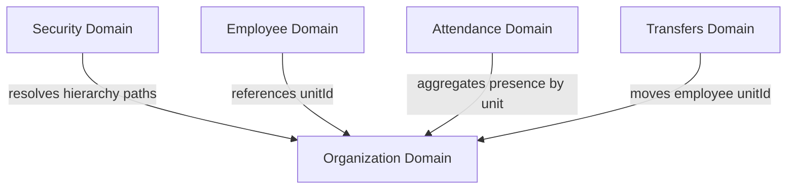

# Organization Domain Architecture

**Domain:** Organization (מבנה ארגוני)  
**Phase:** 15.1 — Organization Domain Architecture  
**Status:** Approved Design

---

## 1. Overview

The Organization domain is the structural backbone of Pikud360. It models the **organization hierarchy tree**, defining how units relate to one another (e.g. Brigade ➔ Department ➔ Section ➔ Cell) and providing the foundation for all scope-based security, dashboard roll-ups, and workforce assignment rules.

While the Employee domain tracks individual people, the Organization domain tracks the structural *positions and containers* where those people are scheduled.

---

## 2. Domain Responsibilities

The Organization domain is solely responsible for structural nodes, hierarchies, and unit meta-information.

### 2.1 Core Responsibilities

| Responsibility | Description |
|---|---|
| **Hierarchy Tree Management** | Defining parent-child relationships between units (preventing circular references and maintaining single-parent tree integrity). |
| **Unit Metadata** | Storing structural properties of a unit (e.g., unit code, unit type, active/inactive state). |
| **Path Resolution** | Calculating the ancestor path from the root node to any target unit (e.g., Brigade 7 ➔ Department A ➔ Section 1 ➔ Cell B) recursively. |
| **Closure Table Compilation** | Maintaining a high-performance query structure (closure table) representing all ancestor-descendant relationships for fast recursive lookups. |
| **Commander Assignment** | Mapping which employee serves as the official commander of a unit (used to resolve approval workflows and dashboard views). |

### 2.2 What the Organization Domain does NOT Own

| Not Owned | Belongs To |
|---|---|
| Mapping user accounts to permissions scope | `security` (Security) |
| Moving employees between units | `transfers` / `workforce` (Transfers/Employee) |
| Active daily schedules of unit staff | `workforce_schedule` (Scheduling) |
| Roster profiling fields (ranks, positions) | `workforce` (Employee) |

---

## 3. Domain Boundaries

The boundaries of the Organization domain protect the unit tree structure from operational transaction details:

```
                  ┌──────────────────────┐
                  │   Security Domain    │
                  │ (evaluates access    │
                  │  using org scopes)   │
                  └──────────┬───────────┘
                             │
                             ▼ (evaluates unitId path)
  ┌─────────────────────────────────────────────────────────────┐
  │ Organization Domain Boundary                                │
  │                                                             │
  │  Owns:                                                      │
  │  - Roster unit trees & paths (core.organization_units)       │
  │  - Parent-child links & tree closures                       │
  │                                                             │
  │  Does NOT Own:                                              │
  │  - User permissions & scope rules                           │
  │  - Employee roster assignments                              │
  └──────────────────────────┬──────────────────────────────────┘
                             │
                             ▼ (contains unitId references)
                  ┌──────────┴───────────┐
                  │   Employee Domain    │
                  │   (workforce logs)   │
                  └──────────────────────┘
```

- **Separation from Security**: The Security domain defines *who has what scope* (e.g. User X has `VIEW` on Cell 1). The Organization domain provides the *hierarchy graph* to verify those scopes (resolving that Cell 1 is a child of Section A, meaning User Y with `VIEW` on Section A also inherits view rights to Cell 1).
- **Separation from Employee**: Employees reference a unit ID (`orgUnitId`), but the unit record does not contain list arrays of assigned personnel. This ensures the unit tree remains stable and metadata changes do not trigger cascading updates across thousands of employee rows.

---

## 4. Organizational Ownership Model

```
┌─────────────────────────────────────────────────────────────────┐
│ Organization Domain Ownership                                   │
│                                                                 │
│ - Primary Database Tables:                                      │
│   - `core.organization_units` (nodes and types)                 │
│   - `core.organization_unit_closure` (compiled tree paths)      │
│                                                                 │
│ - Business Rules Enforced by: OrganizationService               │
│                                                                 │
│ - Write Authority: Tenant Admins / Systems Officers only        │
│                                                                 │
│ - Read Authority: All modules (for scope filtering and paths)  │
└─────────────────────────────────────────────────────────────────┘
```

Commanders can edit their *schedules* and *employee details* within their scope, but they **cannot** modify the organization tree itself (e.g. creating new departments or moving a section to a different brigade). Tree modifications are restricted to tenant-level administrators.

---

## 5. Relationships & Dependencies

### Dependency Direction
The Organization domain is a fundamental system-level module. Almost all other domains depend on it to resolve location context.



### Module Interfaces

- **Security → Organization**:
  - The authorization manager calls `OrganizationService.getSubtree(unitId)` to compile the list of unit IDs a user has inherited rights to view.
- **Transfers → Organization**:
  - When a transfer request is approved, the Transfers module updates the employee's `orgUnitId` to point to a different organization node ID.
- **Attendance → Organization**:
  - Daily roll call reports group status totals by unit ID.

---

## 6. Future Extensibility

To accommodate changes in tenant structures (e.g., military units vs. civilian response forces), the Organization domain is built with extensibility rules.

---

### 6.1 Generic Node Tree Schema
Instead of hardcoding layers (like Section/Department), the domain uses a generic parent-child model where each node has a `type_id` referencing a configurable `unit_types` catalog.

```
Example Unit Types Catalog:
- MILITARY Tenant: Brigade ➔ Department ➔ Section ➔ Cell
- HOSPITALS Tenant: Hospital ➔ Department ➔ Ward ➔ Shift Team
- EMERGENCY Tenant: District ➔ Station ➔ Dispatch Team ➔ Vehicle Crew
```

This catalog can be customized per tenant without database schema adjustments.

---

## 6.2 Custom Metadata Field Mapping
Each organization unit contains a `metadata` JSONB column. This allows tenants to define custom attributes per unit type:

- **Military Cell**: `{ "radioCallsign": "Eagle-1", "gridCoordinate": "147-852" }`
- **Hospital Ward**: `{ "maxBedCapacity": 30, "specialty": "ICU" }`
- **Emergency Station**: `{ "allocatedVehiclesCount": 5 }`

The API exposes this JSON block to the client, allowing the frontend to render tenant-specific unit fields dynamically.

---

## 7. Core Business Rules

| Rule ID | Rule Statement | Reason |
|---|---|---|
| **BR-O01** | The organization hierarchy must be a single-rooted tree. Every unit (except the root) must have exactly one parent unit. | Prevents disjointed trees and loops in path traversals. |
| **BR-O02** | Circular parent-child references are prohibited (e.g. Unit A cannot be a child of Unit B if Unit B is already a child of Unit A). | Prevents infinite loops when resolving hierarchical paths. |
| **BR-O03** | Deleting a unit is prohibited if it contains active children or active assigned employees. | Prevents orphaned records in the database. Unit must be emptied first. |
| **BR-O04** | A unit node cannot be set as inactive if any parent node in its path is inactive. | Maintains structural continuity of the active tree. |
| **BR-O05** | Changes to the organization unit parent-child links must immediately trigger a recompilation of the `core.organization_unit_closure` table. | Ensures permission lookups and aggregate queries have immediate access to the updated tree structure. |
| **BR-O06** | A unit can have at most one active employee assigned as its primary commander at any point in time. | Prevents split command authority loops. |
