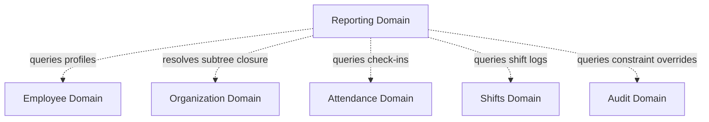

# Reporting Domain Architecture

**Domain:** Reporting (דוחות ואנליטיקה)  
**Phase:** 17.1 — Reporting Domain Architecture  
**Status:** Approved Design

---

## 1. Overview

The Reporting domain in Pikud360 provides the capabilities to query, aggregate, and export system data. It consolidates information from the Workforce (Employee), Organization, Attendance, Scheduling, and Audit domains to generate dashboards, compliance matrices, and downloadable CSV/PDF files.

The domain is decoupled from transactional data capture modules; it is read-only against primary tables but owns its report configurations, scheduler logs, and compiled static assets.

---

## 2. Domain Responsibilities

The Reporting domain is responsible for the calculation, compilation, and delivery of business indicators.

### 2.1 Core Responsibilities

| Responsibility | Description |
|---|---|
| **Data Aggregation** | Executing calculations (headcounts, check-in compliance percentages, late ratios, rest-buffer override frequencies) across organization subtrees. |
| **Document Compilation** | Converting JSON data structures into printable layouts (such as CSV spreadsheets or PDF tables with RTL alignment). |
| **Report Scheduling** | Maintaining automated cron-like execution rules to generate periodic reports (e.g. weekly compliance summaries). |
| **Secure Download Delivery** | Generating short-lived, signed access URLs for static report downloads stored in secure storage buckets. |
| **Export History Logging** | Maintaining a complete history of who generated or downloaded which reports (providing audit paths). |

### 2.2 What the Reporting Domain does NOT Own

| Not Owned | Belongs To |
|---|---|
| Enforcing validation constraints on shifts/check-ins | `workforce_schedule` / `attendance` |
| Primary storage of employee ranks, qualifications | `workforce` |
| Direct rendering of screen dashboard charts | UI Client |

---

## 3. Report Lifecycle

Reports pass through 5 distinct lifecycle phases:

```
  1. REQUEST (דרישת דוח)
        │
        ▼ (triggers background compiler thread)
  2. COMPILATION & AGGREGATION (עיבוד וחישוב)
        │
        ▼ (stores static file, e.g. CSV/PDF)
  3. PERSISTENCE (שמירת קובץ)
        │
        ▼ (delivers temporary signed URL)
  4. DELIVERY (הורדה למשתמש)
        │
        ▼ (expiry cron sweeps metadata, deletes asset)
  5. EXPIRATION & PRUNING (פג תוקף וניקוי)
```

1. **Request**: The user triggers an export action via UI or the scheduler fires a cron job. The system registers a record in `reporting.report_requests` in `PENDING` status.
2. **Compilation**: A background worker compiles the report, querying the database and generating a CSV/PDF asset asynchronously. Status changes to `COMPILING`.
3. **Persistence**: The completed static file is saved to secure storage (e.g. AWS S3 or MinIO). The database record updates to `SUCCESS` and stores the object key.
4. **Delivery**: The user receives a temporary, signed link (expires in 15 minutes) to download the file. The download event is logged.
5. **Expiration & Pruning**: Static files expire after 7 days (or 24 hours for sensitive PII data). A daily system cron deletes the file from storage and marks the request record as `EXPIRED`.

---

## 4. Report Resource Ownership & Authorization

Report generation and visibility are restricted to the operator's organizational view scope:

```
   Brigade Commander (Level 2) ➔ Can generate reports for all Departments, Sections, and Cells in their Brigade.
         │
         ▼
   Department Head (Level 3)   ➔ Restricted to generating reports for child Sections and Cells.
         │
         ▼
   Section Head (Level 4)      ➔ Generates reports for their Section and child Cells.
         │
         ▼
   Cell Leader (Level 5)       ➔ Can only view or download pre-compiled draft reports for their Cell.
```

### Authorization Rules
- **Scope Checking**: Every reporting query executes a JOIN against `core.organization_unit_closure` using the caller's target `scopeNodeId` (HR-04). This prevents a Section Head from generating reports for sibling Sections.
- **Export Logging**: Every manual report request must log the `operatorId`, query parameters, and target unit ID. These requests are mapped to security audit logs (Phase 16.6).

---

## 5. Relationships & Dependencies

The Reporting domain relies on read-only queries across other system modules:



- **Organization → Reporting**: Provides tree closure lookups to aggregate data recursively.
- **Attendance → Reporting**: Provides presence check-in tables to calculate compliance ratios.
- **Shifts → Reporting**: Provides roster tables to calculate coverage ratios.
- **Audit → Reporting**: Provides override justification texts to compile safety audit reports.

---

## 6. Future Extensibility

To support evolving analytical demands without refactoring core services:

---

### 6.1 Custom Template Registration
The domain implements a generic template model. New layouts (e.g. "Monthly Safety Audit Report") are registered by adding metadata mappings to the `reporting.report_templates` table. The template defines:
- The target database view to query.
- The output column headers and alignment rules.
- JSON styling properties.

---

### 6.2 Streaming Export Chunks
For high-volume datasets (e.g., extracting 100,000 check-in rows across an entire Brigade over a year), instead of compiling the entire CSV in memory, the system uses a **reactive database cursor** that streams chunks (e.g., 500 rows at a time) directly to the storage client. This prevents node memory exhaustion.
