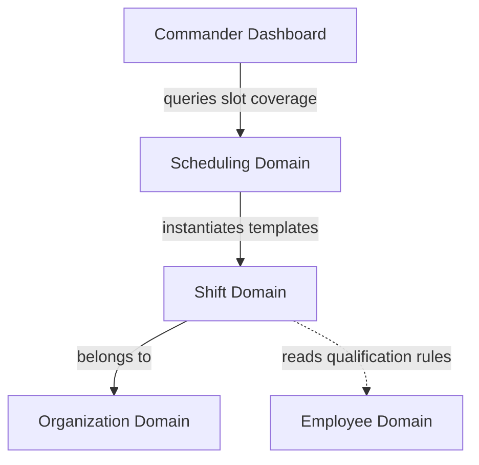
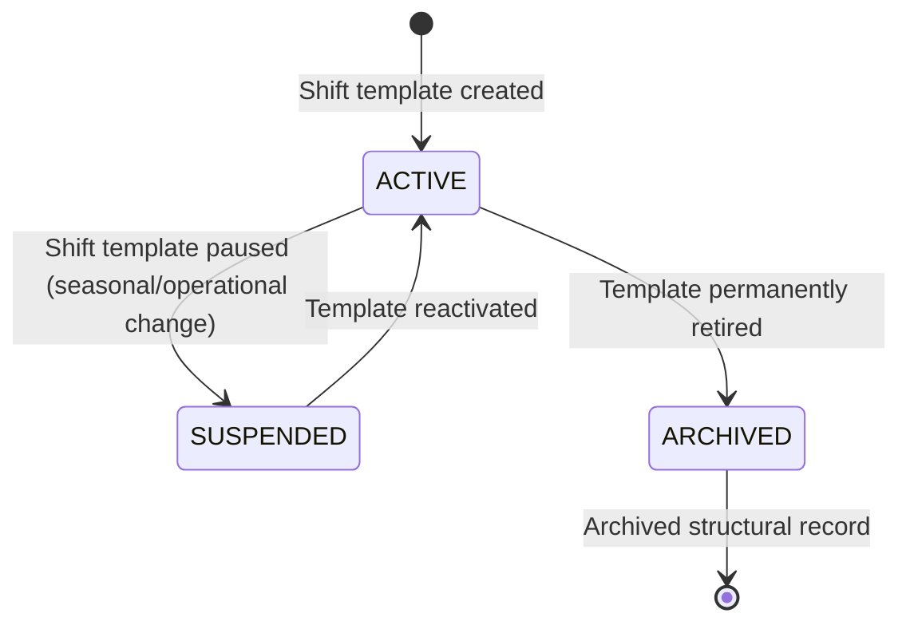

# Shift Management Domain Architecture

**Domain:** Shift Management (משמרות)  
**Phase:** 14.1 — Shift Domain Architecture  
**Status:** Approved Design

---

## 1. Overview

The Shift Management domain is responsible for defining the **time blocks, slot requirements, roles, and structural needs** of the organization's daily scheduling. 

It defines *what shifts exist*, *what qualifications are required* to fill each slot in a shift, and *how templates are cloned* to create active daily schedules.

---

## 2. Domain Responsibilities

The Shift Management domain isolates all rules regarding shift definitions and staffing requirements.

### 2.1 Core Responsibilities

| Responsibility | Description |
|---|---|
| **Shift Type Definitions** | Defining the core types of shifts: name, start time, end time, active status, and unit owner. |
| **Shift Requirement Templates** | Specifying the staffing requirements for a shift type (e.g. Platoon Guard Shift needs: 1 Commander slot, 3 Guard slots, 1 Driver slot). |
| **Slot Qualification Matching** | Mapping required slot credentials (e.g., driver license B, weapons qualification) to employee eligibility attributes. |
| **On-Duty vs. On-Call State** | Tracking whether a shift slot represents physical on-site duty or off-site on-call standby. |
| **Template Replication** | Handling the cloning of unit shift templates to generate active calendar instances in the Scheduling domain. |

### 2.2 What the Shift Domain does NOT Own

| Not Owned | Belongs To |
|---|---|
| Assigning specific employees to specific calendar dates | `workforce_schedule` (Scheduling) |
| Actual daily roll call status | `workforce_schedule` (Attendance) |
| Employee profile credentials and records | `workforce` (Employee) |
| Permission scopes | `security` (Security) |

---

## 3. Domain Boundaries

The boundaries of the Shift domain prevent scheduling and profile logic from polluting shift definitions:

```
                  ┌──────────────────────┐
                  │   Employee Domain    │
                  │ (provides credentials)│
                  └──────────┬───────────┘
                             │
                             ▼ (checks eligibility)
  ┌─────────────────────────────────────────────────────────────┐
  │ Shift Domain Boundary                                       │
  │                                                             │
  │  Owns:                                                      │
  │  - Shift templates & structures (shift_types table)          │
  │  - Slot definitions & requirement rules                     │
  │                                                             │
  │  Does NOT Own:                                              │
  │  - Calendar instance date slots                             │
  │  - Assigned employee IDs for a date                         │
  └──────────────────────────┬──────────────────────────────────┘
                             │
                             ▼ (instantiated as date slots)
                  ┌──────────┴───────────┐
                  │  Scheduling Domain   │
                  │ (daily calendar grids)│
                  └──────────────────────┘
```

- **Separation from Scheduling**: The Shift domain owns the *template definition* (e.g. Platoon Guard Shift is 22:00-06:00, requires 1 commander and 3 guards). The Scheduling domain owns the *calendar instances* (e.g. assigning John Doe to the Platoon Guard Shift on Monday, July 20th).
- **Separation from Employee**: Shift slots require qualifications (e.g. `driverLicenseClass: "C1"`). The Shift domain reads the catalog of qualifications from the Employee domain to validate templates, but does not modify employee profiles.

---

## 4. Business Ownership Model

```
┌─────────────────────────────────────────────────────────────────┐
│ Shift Domain Ownership                                          │
│                                                                 │
│ - Primary Database Tables:                                      │
│   - `workforce_schedule.shift_types` (structural blocks)        │
│   - `workforce_schedule.shift_requirements` (template slots)     │
│                                                                 │
│ - Business Rules Enforced by: ShiftService                      │
│                                                                 │
│ - Write Authority: Unit Commanders (for unit shift templates)    │
│                                                                 │
│ - Read Authority: Scheduling Module, Dashboard, Reports         │
└─────────────────────────────────────────────────────────────────┘
```

Only the `ShiftService` has write authority over the shift structural tables. The Scheduling domain instantiates shifts by referencing template configurations.

---

## 5. Relationships & Dependencies

### Dependency Direction
The Shift domain depends on the **Organization** domain for unit ownership, and is referenced by the **Scheduling** domain.



### Module Interfaces

- **Scheduling → Shift**:
  - The Scheduling module queries the active shift templates of a unit when generating the calendar grid for a new week or month.
- **Employee → Shift**:
  - The eligibility checker reads the shift slot's required credentials and compares them against employee profile fields.

---

## 6. Shift Configuration Lifecycle

Shift templates and their slot requirements pass through a structural lifecycle that controls whether they can be used for active scheduling.

### 6.1 State Machine Diagram



### 6.2 State Descriptions

---

#### 1. ACTIVE (פעיל)

**Description:**
The shift template is currently active and available to generate calendar instances for scheduling.

**Business Rules:**
- Appears in the list of templates when a commander initiates a weekly schedule creation.
- Slot requirement schemas are validated and fully editable.

---

#### 2. SUSPENDED (מוקפא)

**Description:**
The template is temporarily disabled (e.g. a winter patrol shift that is not used during summer months).

**Business Rules:**
- Excluded from weekly calendar generation views.
- Existing historical calendar instances generated from this template remain intact and queryable.
- Can be reactivated at any time by an authorized commander.

---

#### 3. ARCHIVED (בארכיון)

**Description:**
The shift template is permanently retired (e.g. due to unit structural reorganization).

**Business Rules:**
- Fully read-only structural record.
- Cannot be reactivated.
- Excluded from all active list views.
- Preserved in the database with a soft-delete timestamp (`deleted_at`) to maintain the integrity of historical scheduling logs referencing this template ID.

---

## 7. Core Business Rules

| Rule ID | Rule Statement | Reason |
|---|---|---|
| **BR-S01** | Every shift type must have a defined name, start time, end time, and be assigned to a specific organizational unit. | Prevents empty or floating shifts that cannot be mapped to the calendar. |
| **BR-S02** | Shift start and end times must be defined in 24-hour format (`HH:mm:ss`). | Ensures format consistency and supports midnight-boundary calculations. |
| **BR-S03** | A shift type's duration cannot exceed 24 hours. | Longer durations represent multi-day deployments and must be modeled as separate sequential shifts. |
| **BR-S04** | Modifying an active shift template (e.g. altering start time or slot counts) does not retroactively change already generated calendar instances. | Protects historical schedule records from unintentional modifications. |
| **BR-S05** | A shift slot template must specify the required role and optional qualification requirements (e.g., driver license, clearance level). | Enables the scheduling engine to execute automatic eligibility filters. |
| **BR-S06** | The total slot requirement count of an active shift must contain at least 1 slot. | A shift with 0 slots has no operational meaning. |
| **BR-S07** | Deleting a shift template is implemented as a soft-delete (`deleted_at` timestamp). Hard deletes are prohibited. | Preserves foreign key relationships in historical schedule logs. |
