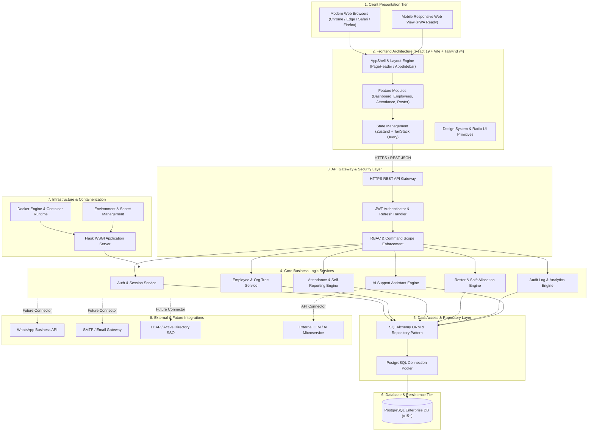
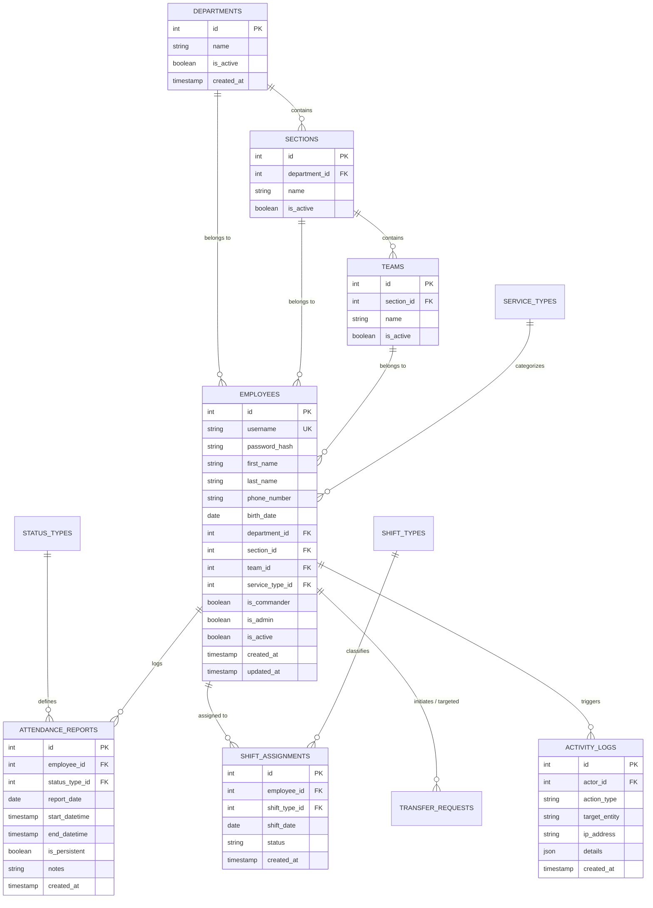
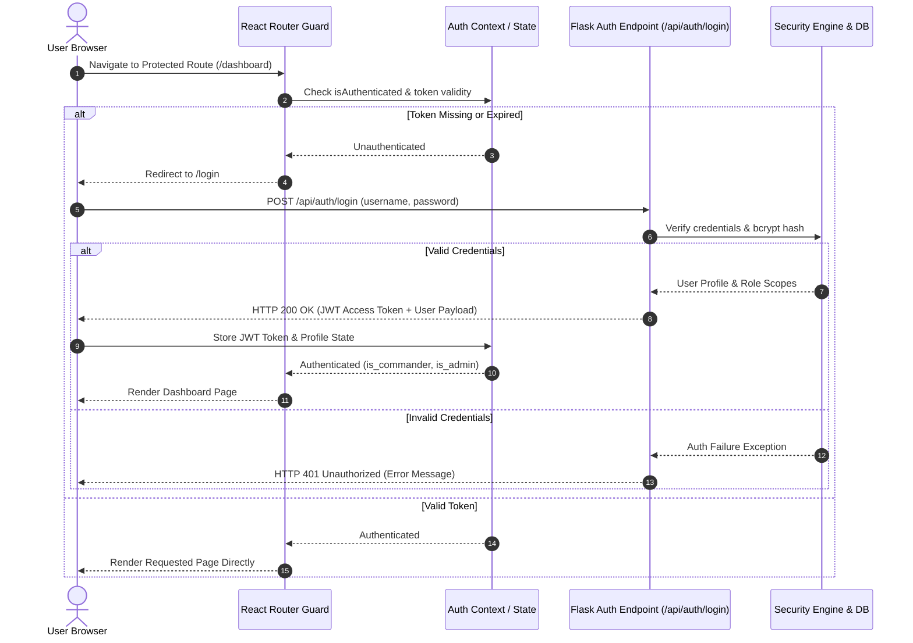
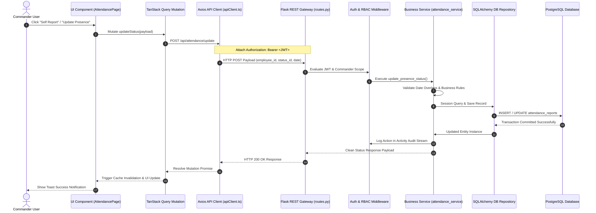
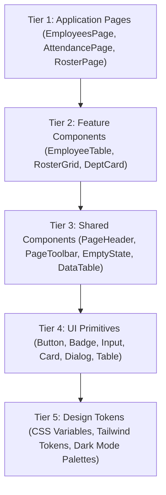
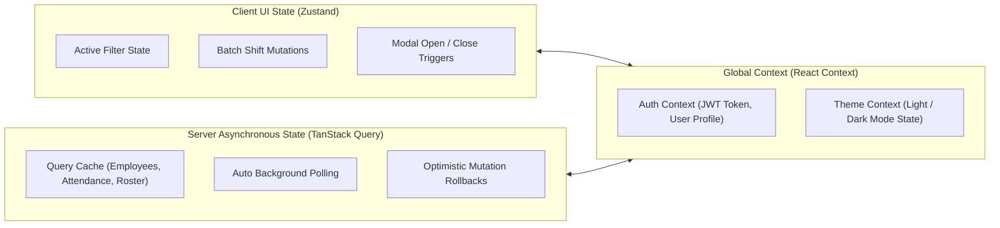
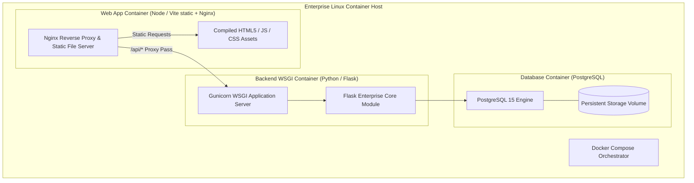
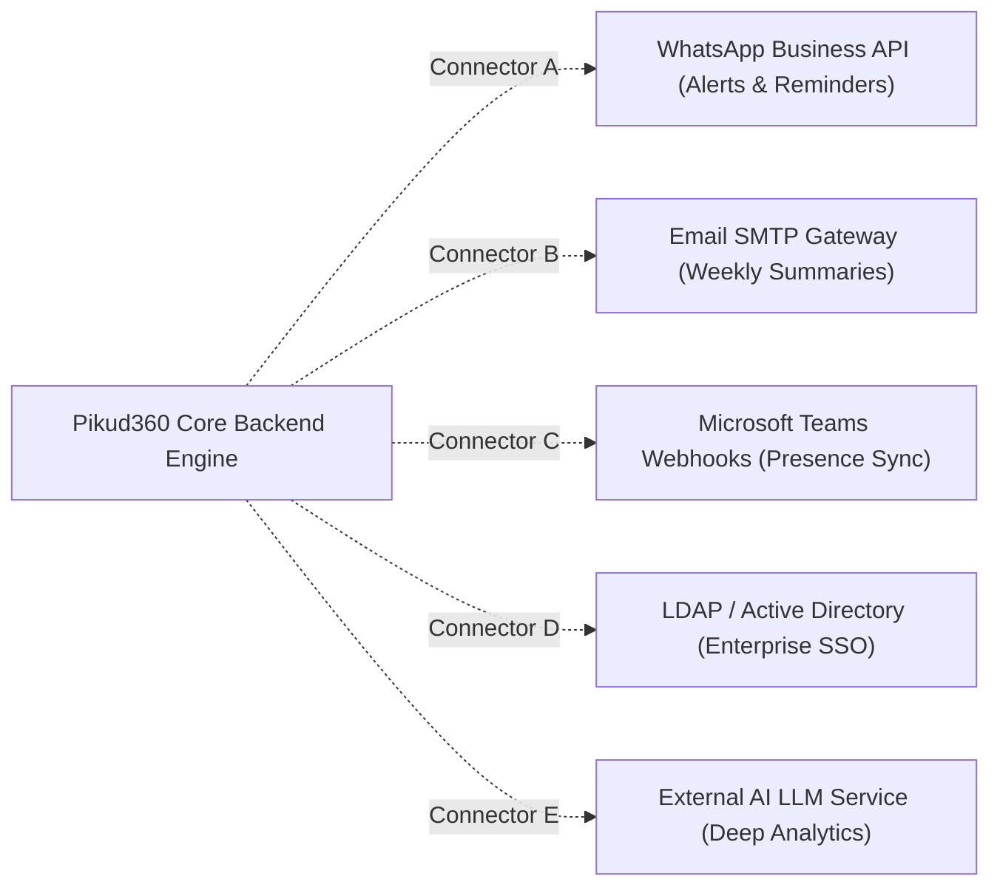
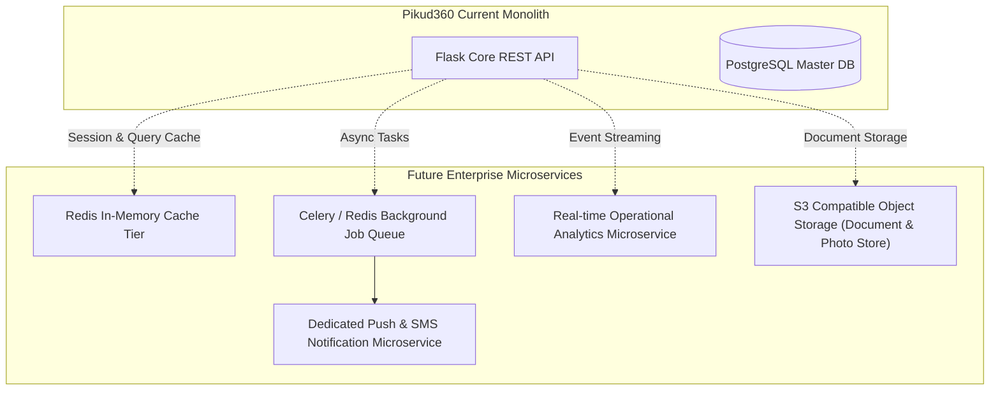

# Pikud360 Enterprise System Architecture Documentation

**System Title:** Pikud360 Enterprise Workforce & Operation Control Platform  
**Architecture Version:** 2.0.0  
**Classification:** Official Enterprise Software Documentation  
**Branding:** Pikud360 Design System & Enterprise Architecture  

---

## Executive Summary

**Pikud360** is a next-generation, high-performance enterprise workforce management, presence tracking, operational scheduling, and personnel administration platform built for mission-critical organizations. Designed with a clean feature-based modular architecture, full Hebrew RTL support, glassmorphic UI aesthetics, and resilient RESTful micro-service ready APIs, Pikud360 provides real-time visibility and command over organizational hierarchy, daily presence, shift rosters, and audit event streams.

---

# 1. High Level Architecture

The Pikud360 platform adheres to a strictly decoupled, multi-tier enterprise architecture. Separation of concerns is enforced between the visual presentation tier, API gateway layer, business logic engine, data repository layer, and infrastructure persistence tier.



---

# 2. Frontend Architecture

The frontend application is constructed using a high-density, modern web stack designed for zero-latency user interactions, instant page transitions, and complete Hebrew RTL layout fidelity.

```
src/
├── assets/             # Vector icons, branding logos, static media assets
├── components/         # System-wide UI component library
│   ├── common/         # Domain-agnostic shared utilities (EmployeeLink, ErrorBoundary, TourGuide)
│   ├── layout/         # Core layout components (AppHeader, AppSidebar, PageHeader)
│   └── ui/             # Atomic UI primitives (button, badge, data-table, dialog, empty-state, toolbar)
├── config/             # Axios API client, environment constants, route definitions
├── context/            # Global React contexts (AuthContext, ThemeContext)
├── features/           # Self-contained feature modules
│   ├── attendance/     # Attendance tracking hooks, components, types
│   ├── auth/           # Login form, token storage, authentication hooks
│   ├── dashboard/      # StatCards, Charts, Birthday widgets, KPI cards
│   ├── employees/      # Employee table, filter dialog, CSV importer, form modals
│   ├── organization/   # Org tree chart, department/section cards, team badges
│   └── roster/         # Weekly schedule grid, shift allocation, batch save
├── hooks/              # Reusable custom React hooks (useTheme, usePermission, useDebounce)
├── lib/                # Utility helper functions (cn, date formatting, unit cleaners)
├── pages/              # Top-level page views (DashboardPage, EmployeesPage, RosterPage)
├── types/              # TypeScript enterprise interfaces and data schemas
└── App.tsx             # Root router, query client provider, toast provider
```

### Core Frontend Stack & Technologies

1. **React 19:** Leverages functional components, `startTransition`, concurrent rendering, and strict effect boundaries.
2. **TypeScript:** Strict type checking across all data contracts, UI props, API responses, and Zustand state slices.
3. **Vite:** High-speed development server with lightning-fast HMR and optimized production Rollup bundling.
4. **Tailwind CSS v4:** Modern CSS engine using native CSS custom properties for instant theme switching and responsive design tokens.
5. **Radix UI Primitives:** Unstyled, accessible (WAI-ARIA compliant) headless primitives for dialogs, dropdown menus, popovers, tooltips, and tabs.
6. **shadcn/ui Design System:** Curated atomic UI primitive suite customized with Pikud360 design tokens (`rounded-xl`, glassmorphic backdrops, compact enterprise padding).
7. **Framer Motion:** Micro-animations for modal dialog slide-ins, tab transitions, drawer expansions, and toast alerts.
8. **React Router v6:** Declarative client-side routing with protected route guards (`ProtectedRoute`), nested layouts, and search param bindings.
9. **TanStack Query (React Query):** Asynchronous server-state management with automatic background refetching, query caching, and optimistic mutations.
10. **Zustand:** Lightweight, predictable client-side store for UI state, batch shift edits, active filter states, and active modal controls.
11. **Theme Provider:** Single global theme provider supporting instant Light / Dark mode toggle with `localStorage` persistence and `prefers-color-scheme` fallback.
12. **Hebrew RTL Support:** Native `dir="rtl"` layout directionality, right-aligned table columns, RTL flex/grid alignments, and Hebrew typography (`Noto Sans Hebrew`).

---

# 3. Backend Architecture

The backend application is designed around Python and Flask, implementing a layered enterprise service pattern with strict domain isolation and security boundaries.

```
backend/
├── app/
│   ├── config/          # Flask settings, DB URIs, JWT secret configurations
│   ├── core/            # Database engine, SQLAlchemy session factory, base model
│   ├── middleware/      # Auth guard, RBAC permission decorator, CORS header handler
│   ├── modules/         # Feature backend modules
│   │   ├── activity_log/# Audit logging models, routes, and recording services
│   │   ├── attendance/  # Presence tracking, self-report validation, daily stats
│   │   ├── auth/        # Login routes, JWT generation, password verification
│   │   ├── employees/   # Personnel CRUD, filter queries, CSV parsing
│   │   ├── organization/# Departments, sections, teams hierarchical endpoints
│   │   ├── roster/      # Shift schedule allocation, bulk updates, shift types
│   │   └── transfers/   # Transfer requests, assignment workflows, approvals
│   └── utils/           # Date formatters, security helpers, response wrappers
├── migrations/          # Alembic database migration scripts
├── run.py               # WSGI application entrypoint
└── requirements.txt     # Python dependency specifications
```

### Layered Architecture Responsibilities

- **REST API Layer (Routes):** Exposes clean JSON endpoints, parses HTTP request parameters, handles multipart CSV file uploads, and returns standard HTTP status codes.
- **Validation Layer:** Enforces request payload validation, sanitizes input strings, and validates date formats prior to service invocation.
- **Business Logic Layer (Services):** Encapsulates core business rules, permission scope calculations (Admin vs Commander vs Officer), shift overlap checks, and status continuity calculations.
- **Repository & Data Access Layer (SQLAlchemy ORM):** Interacts with PostgreSQL using parameterized queries, transactional units of work (`db.session.commit()`), and lazy/joined relationships.
- **RBAC & Authorization Middleware:** Decorators (`@require_auth`, `@require_commander`, `@require_admin`) evaluate JWT tokens, decode user scopes, and enforce command hierarchy boundaries.
- **Audit Logging Engine:** Automatically captures write operations (Create, Update, Delete, Bulk Import) with IP addresses, timestamps, actor IDs, and payload summaries.

---

# 4. Database Architecture

Pikud360 utilizes **PostgreSQL** as its enterprise relational database system. The database schema enforces strict referential integrity, performance indexing, soft deletion, and comprehensive audit trail metadata.

### Data Model & Entity Relationship Overview



### Key Schema Characteristics
- **UUID & Enterprise Auto-Increment IDs:** Primary keys use indexed auto-increment integer or UUID identifiers for rapid lookup and foreign key integrity.
- **Indexed Search Columns:** B-Tree indexes applied to `username`, `department_id`, `section_id`, `team_id`, `report_date`, `shift_date`, and `created_at`.
- **Soft Deletion & Active Flags:** Tables feature `is_active` boolean fields to preserve historical audit data without physical row removal.
- **Audit Metadata:** Tables include `created_at`, `updated_at`, and `created_by` timestamp fields.

---

# 5. Authentication Flow

Authentication in Pikud360 is powered by stateless **JSON Web Tokens (JWT)** with HTTP-Only cookie and Bearer Authorization header support.



---

# 6. Request Flow

The diagram below illustrates the end-to-end processing pipeline of a client request (e.g., updating an employee's presence status).



---

# 7. Feature Modules

Pikud360 is organized into self-contained feature modules. Each module maintains its own domain components, custom hooks, API calls, and types.

| Feature Module | Core Responsibility | Key Components & Services |
| :--- | :--- | :--- |
| **Authentication** | User login, credential validation, JWT token lifecycle, quick role switcher, and session security. | `LoginPage`, `useAuthContext`, `ProtectedRoute`, `authService` |
| **Dashboard** | Executive operational overview, KPI stat cards, birthday alerts, age distribution, presence donut charts. | `DashboardPage`, `MetricCard`, `BirthdayCard`, `OrgTreeChart` |
| **Employees** | Master personnel directory, search & multi-filter, CSV bulk import, employee creation/editing modals. | `EmployeesPage`, `EmployeeTable`, `FilterModal`, `CSVImporter` |
| **Attendance** | Daily presence tracking, self-reporting, commander bulk status updates, historical presence calendar. | `AttendancePage`, `AttendanceHeader`, `PresenceModal`, `CalendarGrid` |
| **Roster** | Weekly shift scheduling grid, shift type allocation, pending change batching with save/undo support. | `RosterPage`, `RosterGrid`, `ShiftCell`, `BatchSaveBar` |
| **Transfers** | Cross-unit personnel transfer requests, assignment workflow processing, approval/rejection queues. | `TransfersPage`, `TransferCard`, `RequestModal`, `TransferWorkflow` |
| **Feedback** | Internal feedback ticketing, commander system alerts, system version updates, user suggestion box. | `FeedbackPage`, `FeedbackCenter`, `SupportTicketModal` |
| **Activity Log** | System audit logging stream, security exception detection, historical user action trail, CSV exports. | `ActivityLogPage`, `AuditStreamTable`, `SecurityAlertBanner` |
| **Notifications** | Toast notification manager, inline action alerts, real-time status banners. | `NotificationCenter`, `SonnerToastProvider`, `AlertBadge` |
| **Settings** | User security credentials, appearance mode selection (Light/Dark), system preferences. | `SettingsPage`, `ProfileCard`, `ThemeSwitcher`, `SecurityForm` |
| **Organization** | Hierarchical unit viewer (Department → Section → Team), unit member stats, structural tree visualization. | `OrganizationPage`, `DeptCard`, `SectionTree`, `TeamBadge` |
| **AI Assistant** | Intelligent operational support bot, shift policy query assistance, quick system guide overlay. | `GlobalAiSupport`, `FloatingHelpButton`, `TourGuideOverlay` |

---

# 8. Shared Component Architecture

To prevent duplication and guarantee 100% visual consistency across all pages, Pikud360 strictly enforces a 5-tier component reuse hierarchy.



### Reuse Rules
1. **Search Before Creation:** Always search the component library before introducing new UI elements.
2. **Component Ownership:** Shared layout elements (`PageHeader`, `PageToolbar`) are owned by the Layout System and must never be overridden by individual pages.
3. **Standard Page Template:** Every page strictly adheres to the top-to-bottom layout hierarchy:
   $$\text{Global Header (shared)} \longrightarrow \text{Page Header} \longrightarrow \text{Page Toolbar} \longrightarrow \text{Page Content} \longrightarrow \text{Dialogs/Drawers} \longrightarrow \text{Notifications}$$

---

# 9. State Management

Pikud360 employs a hybrid state management model to ensure clear boundaries between global application state, server state, and transient UI state.



- **Zustand Stores:** Used for instantaneous client-side UI states such as batch shift scheduling state (`useRosterStore`), active filter combinations, and dashboard metric calculations.
- **TanStack Query (React Query):** Manages server asynchronous requests, query key caching, automatic invalidation (`queryClient.invalidateQueries()`), and optimistic UI updates.
- **React Context:** Reserved for top-level provider states including authentication JWT tokens and dark mode preferences.

---

# 10. Infrastructure & Deployment

The platform is designed to be deployed cleanly via containerized environments or standalone enterprise WSGI application servers.



- **Environment Configuration:** Secrets, database connection strings, and JWT signing keys are loaded securely via environment variables (`.env` / `settings.py`).
- **Static Asset Serving:** Frontend bundles compiled via Vite into lightweight, browser-cacheable static assets.
- **Logging & Diagnostics:** Centralized JSON logging captures Flask HTTP requests, DB query execution times, and unhandled runtime exceptions.

---

# 11. External Integrations (Integration Ready)

The system includes pre-reserved architectural extension points for enterprise third-party integration connectors.



---

# 12. Security Architecture

Pikud360 enforces enterprise-grade defense-in-depth security mechanisms across all layers.

- **HTTPS Transmission Security:** All client-server communications are encrypted via TLS 1.3.
- **JWT Authentication Security:** Tokens signed with HMAC-SHA256 algorithms containing strict expiration timestamps.
- **Bcrypt Password Hashing:** User credentials hashed using standard salted Bcrypt hashing algorithms.
- **Role-Based Access Control (RBAC):** Access rights segregated strictly between Administrator, Commander, Officer, and Read-Only roles.
- **Command Scope Enforcement:** Commanders are strictly restricted to querying and mutating personnel within their assigned organizational unit.
- **SQL Injection & XSS Protection:** Parameterized SQLAlchemy ORM queries eliminate SQL injection risks. React HTML encoding prevents cross-site scripting (XSS).
- **Audit Logging Stream:** Immutable activity logs capture write operations with actor metadata and remote client IP addresses.

---

# 13. Technology Stack Reference

| Technology | Domain | Selected Version | Enterprise Purpose & Rationale |
| :--- | :--- | :--- | :--- |
| **React** | Frontend Core | `v19.0.0` | Ultra-fast declarative UI rendering with modern hooks and concurrent features. |
| **TypeScript** | Language | `v5.7.0` | End-to-end type safety, robust auto-completion, and reduced runtime errors. |
| **Vite** | Build Tool | `v6.0.0` | High-speed HMR development server and optimized Rollup production bundler. |
| **Tailwind CSS** | Styling | `v4.0.0` | Utility-first CSS engine using native CSS variables for instant theme switching. |
| **Radix UI** | UI Primitives | Latest | Accessible, unstyled headless primitives ensuring 100% WAI-ARIA compliance. |
| **TanStack Query**| Async State | `v5.0.0` | Asynchronous server-state management with built-in caching and invalidation. |
| **Zustand** | Client State | `v5.0.0` | Fast, lightweight client-side state store without boilerplate overhead. |
| **Framer Motion**| Animations | `v11.0.0` | Smooth micro-animations for modal dialogs, tab switches, and alerts. |
| **Python / Flask**| Backend Core | `v3.11 / v3.0` | Lightweight, scalable Python REST framework with extensible micro-service architecture. |
| **SQLAlchemy** | Database ORM | `v2.0` | Robust object-relational mapping, connection pooling, and migration safety. |
| **PostgreSQL** | Database DB | `v15.0+` | Enterprise relational database system supporting transactions, JSONB, and indexing. |

---

# 14. Development Standards

All software development within Pikud360 adheres strictly to standardized development guidelines:

1. **Feature-Based Architecture:** Code is organized by domain features (`features/attendance`, `features/employees`), keeping business logic self-contained.
2. **Mandatory UI Standardization:** Pages **must** reuse approved shared components (`PageHeader`, `PageToolbar`, `DataTable`, `EmptyState`, `StatusBadge`). Page-specific duplicates are strictly prohibited.
3. **Single Component Ownership:** Each reusable component has a single system owner (e.g., `PageHeader` → Layout System). Pages must never override component internals.
4. **Zero Hardcoded Values Rule:** Colors, padding, font sizes, and borders must reference Design System variables or Tailwind tokens.
5. **Definition of Done:** A feature module is complete only when it compiles with **0 TypeScript errors**, supports RTL & Dark Mode, links to live APIs, and removes all mock data and TODO comments.

---

# 15. Future Architecture Roadmap

The Pikud360 system architecture is prepared for high-scale enterprise expansion through the following reserved modules:



- **Redis Caching Tier:** High-speed in-memory caching for organizational tree structures and active presence counters.
- **Background Worker Queue (Celery / Redis):** Asynchronous processing for heavy CSV bulk imports, automated daily presence reminders, and periodic report generation.
- **Dedicated Notification Microservice:** Multi-channel push notification engine for SMS, Email, and WhatsApp alerts.
- **Analytics & BI Engine:** High-performance data warehouse connector for historical attendance trend analysis and predictive scheduling.

---
*End of Enterprise Architecture Documentation — Pikud360 Platform*
